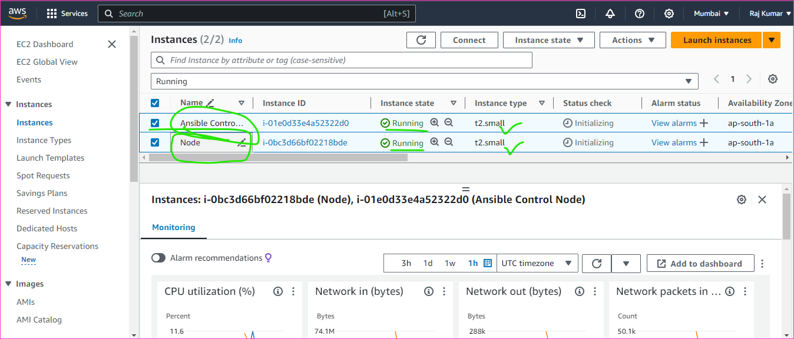

Setup the Ansible Control Node and Node
-------------------------------------------

### We have two ways to install the ansible
* One is Package Manager approach
* Second one is Python approach
* When the ansible present in the server that server will call it as Ansible Control Node

### Ansible deals with Credentials
* There are two possible ways of Credentials
    * username and password
    * username and key

Note
----
* The secure way is username and key, When connect to each other.   

### Prerequisites
-----------------
* To begin with creating two EC2 instances in AWS account
* with instance type is t2 small and then select the linux os as Ubuntu 22.04
* In addition to java to be installed, version 17
* The PasswordAuthentication should be __Yes__ 
```
vi /etc/ssh/sshd_config
sudo service restart sshd or sudo systemctl restart sshd
```
* Add the user for the Adminstration purpose
* And then add the user to sudoers file because of when you login to user it will not asking password
```
sudo visudo
```
* Finally we should add the node to ACN(ansible control node) for authenticate to each other
```ACN
ssh-copy-id <username>@<private_ip-address of node> 
```

* Create two EC2 instances


* and login to both the machines and do the configurations
```
vi /etc/ssh/sshd_config
# Change the __PasswordAuthentication__ should be no __yes__

sudo service restart sshd
sudo adduser <username>
# It will ask password and give some password to it and reconfirm the password

sudo visudo
# Add the user to sudoers file 

```


* Ansible installation steps
```
sudo apt update
sudo apt install software-properties-common
sudo add-apt-repository --yes --update ppa:ansible/ansible
sudo apt install ansible
```